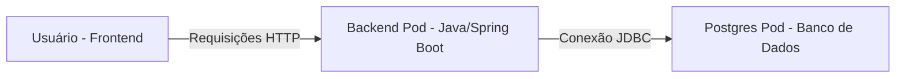

# Academia GIT 🏋️‍♂️

Welcome to the **Academia GIT** project repository. This application is a full-stack gym management system developed to integrate modern front-end practices with a robust back-end architecture.

---

## 🏗️ System Architecture

The application follows a clean separation of concerns, with the front-end communicating via REST APIs with a Java Spring Boot backend, which persists data in a PostgreSQL database containerized for scalability.



---

## 🚀 Technical Journey

This project is being built with a focus on modularity and constant testing:

* **Back-end:** Built with Java Spring Boot, handling entities like `Modalidades`, `Professores`, and `Alunos`.
* **Front-end:** A Single Page Application (SPA) developed in Angular 19/20, utilizing `RouterOutlet` for seamless navigation and `Standalone Components` for maintainability.
* **Infrastructure:** The database is managed via Docker containers, ensuring consistent development environments.

---

## 🎨 Frontend Design System

To ensure a cohesive user experience, we are implementing the following design principles:

| Element | Specification |
| --- | --- |
| **Typography** | Sans-serif (Arial/Roboto) for high readability |
| **Primary Color** | Professional Navy/Blue for reliability |
| **Spacing** | Consistent use of CSS Flexbox and standardized margin/padding |
| **Components** | Standalone Angular components with encapsulated SCSS |

---

## 🛠️ Getting Started

### Prerequisites

* Node.js (v18+)
* JDK 17+
* Docker Desktop

### Installation

1. Clone the repository:
```bash
git clone https://github.com/engenheiromuniz/academia-git.git

```


2. Navigate to the `backend` folder and run the Spring application.
3. Navigate to the `frontend` folder, install dependencies (`npm install`), and run `ng serve`.

---

*Developed by André Luiz da Câmara Muniz* 🚀

